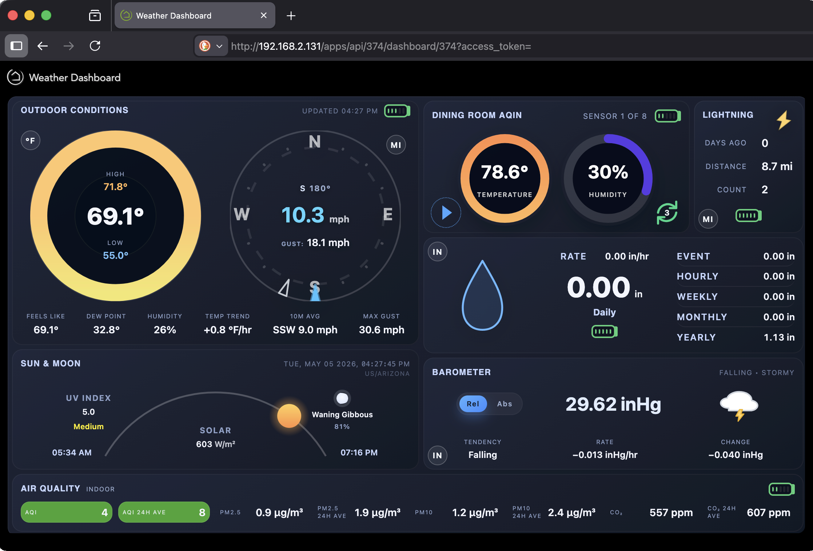

# Hubitat Weather Dashboard

Self-contained rich weather dashboard for Hubitat. Instead of building a dashboard one tile at a time or looking at raw sensor numbers across many devices, this app and dashboard bring your personal weather station data together into one visual display with current conditions, trends, rain and wind details, sensor status, and a basic forecast. It is designed for people who connect their personal weather station to Hubitat and want a complete local weather console (no web access required).

The default data layout is loosely based on the Ecowitt HP2561 / AmbientWeather WS-2000 console and is very customizable. See Runtime Layout Overrides below.

## Project layout

```
README.md
app/
  weather-dashboard-app.html   Preview shell loaded from Hubitat File Manager
  weather-dashboard-app.js     Preview bootstrap and Maker API fetch logic
dashboard/
  weather-dashboard.js         Bundled dashboard renderer for Hubitat tiles
docs/
  screenshots/                 README screenshot assets
  build-and-test.md            Local build, dependency, and verification guide
hubitat/
  WeatherDashboardApp.groovy   Hubitat app that builds the JSON payload
  WeatherDashboardDevice.groovy Virtual device driver that exposes payload segments
src/
  ...                          Source modules used to build dashboard/weather-dashboard.js
tests/
  ...                          Node, Groovy, and browser harnesses
```

## Overview

1. `WeatherDashboardApp` collects the selected weather-device attributes, calculates derived values, and publishes a consolidated JSON payload.
2. `WeatherDashboardDevice` stores the payload as deterministic JSON segments so Hubitat dashboards can read it within attribute-size limits.
3. `dashboard/weather-dashboard.js` renders the payload inside a single Hubitat dashboard tile.
4. `app/weather-dashboard-app.html` and `app/weather-dashboard-app.js` provide the Hubitat app landing-page preview and Maker API fetch path.



## Hubitat Setup Summary

The dashboard has two setup parts:

* **File installation** - install the Groovy app and driver and upload the JavaScript/HTML assets using the Hubitat File Manager.
* **Functional setup** - configure the app for your weather devices, create the dashboard virtual device, configure the dashboard and required attribute tiles, and optionally configure Maker API for the app dashboard preview.

### Install With Hubitat Package Manager

Hubitat Package Manager can install the app, driver, and all three File Manager assets from this package manifest:

* [packageManifest.json](https://raw.githubusercontent.com/sonoranwanderer/hubitat_weather_dashboard/main/packageManifest.json)

After HPM finishes, continue with **Create And Configure The Weather Dashboard App** below.

### Manual Install Links

Use these links if you are installing manually:

* [WeatherDashboardDevice.groovy](https://raw.githubusercontent.com/sonoranwanderer/hubitat_weather_dashboard/main/hubitat/WeatherDashboardDevice.groovy)
* [WeatherDashboardApp.groovy](https://raw.githubusercontent.com/sonoranwanderer/hubitat_weather_dashboard/main/hubitat/WeatherDashboardApp.groovy)
* [weather-dashboard.js](https://raw.githubusercontent.com/sonoranwanderer/hubitat_weather_dashboard/main/dashboard/weather-dashboard.js)
* [weather-dashboard-app.js](https://raw.githubusercontent.com/sonoranwanderer/hubitat_weather_dashboard/main/app/weather-dashboard-app.js)
* [weather-dashboard-app.html](https://raw.githubusercontent.com/sonoranwanderer/hubitat_weather_dashboard/main/app/weather-dashboard-app.html)

### Dependencies

* **Weather Device(s)** - required
  * The dashboard can use any weather data sources that expose weather data in Hubitat via device attributes. By default it expects Ecowitt-style attribute names such as `temperature`, `humidity`, `windSpeed`, `windGust`, `windDirection`, `pressure`, `rainRate`, and `rainDaily`. However attribute names can be remapped in the app if your weather devices use different attribute names.
* **Maker API** (Hubitat Built-in App) - optional
  * Hubitat's built-in [**Maker API**](https://docs2.hubitat.com/en/apps/maker-api) app if you want the embedded app dashboard preview or external web clients to fetch the weather dashboard directly (not using the Hubitat Dashboard app and interface). 
  * The Hubitat Dashboard tile itself does not require Maker API.

### 1. Install The Hubitat Code

Install both Groovy files in Hubitat:

1. Open [**Drivers Code**](https://docs2.hubitat.com/en/how-to/install-custom-drivers) and add the contents of `hubitat/WeatherDashboardDevice.groovy`.
2. Open [**Apps Code**](https://docs2.hubitat.com/en/how-to/install-custom-apps) and add the contents of `hubitat/WeatherDashboardApp.groovy`.
3. Save both files.

The driver is the virtual device that exposes dashboard attributes. The app reads your weather devices, calculates derived values and a basic forecast, and pushes segmented JSON into the weather dashboard virtual device.

### 2. Upload The Local Assets

Upload these files to Hubitat [**File Manager**](https://docs2.hubitat.com/en/user-interface/settings/file-manager) at the File Manager root:

* `dashboard/weather-dashboard.js`
* `app/weather-dashboard-app.js`
* `app/weather-dashboard-app.html`

They should be reachable from the hub as:

* `/local/weather-dashboard.js`
* `/local/weather-dashboard-app.js`
* `/local/weather-dashboard-app.html`

Keep these filenames unless you also update the matching app/device settings.

### 3. Create And Configure The Weather Dashboard App

1. Open **Apps**, choose **Add User App**, and install **Weather Dashboard App**.
2. Open **Configure data sources**.
3. Select the weather source device or devices under **Weather devices**.
4. Review the attribute mapping sections. Keep the defaults when your weather driver uses the listed attribute names; otherwise choose the correct device and enter the attribute name used by your Hubitat device.
5. Set input and display units for temperature, rainfall, wind, pressure, and lightning distance. These must match the units reported by the source devices so the dashboard converts values correctly.
6. Configure optional sources only when you have them: outdoor/indoor air quality, lightning, sensor batteries, and ambient temperature/humidity sensors.
7. Choose refresh behavior. Leave the default event-driven refresh plus one-minute cron enabled unless you know your source device is too noisy.
8. Set the **Dashboard device label**, then click **Save & Refresh**.

After saving, the app creates or updates the Weather Dashboard virtual device. Open that device in **Devices** and confirm it has attributes such as `dashboardScript`, `segmentCore`, `segmentPrecip`, `segmentAirQuality`, `segmentMeta`, `segmentLayout`, and `segmentAmbient1` through `segmentAmbient6`. Empty optional segments may show `{}`; that is normal.

### 4. Add The Hubitat Dashboard Tiles

The rendered dashboard uses one visible Attribute tile plus several hidden/source Attribute tiles from the same Weather Dashboard virtual device.

The easiest setup path is the generated dashboard import template:

1. Open **Apps -> Weather Dashboard App -> Dashboard Setup**.
2. Copy the generated Hubitat Dashboard layout JSON.
3. Create a new Hubitat Dashboard or export the JSON from an existing dashboard as a backup.
4. Use the dashboard's layout import option to paste the generated JSON.
5. Save the dashboard and refresh the browser page.

The generated template creates one visible `dashboardScript` Attribute tile plus the required source Attribute tiles. The source tiles are hidden by dashboard CSS and by the renderer after it reads them.

Manual setup is still supported:

1. Open the target Hubitat dashboard.
2. Add an **Attribute** tile for the Weather Dashboard virtual device and choose the `dashboardScript` attribute. Add this tile first so Hubitat gives it the `tile-0` DOM id. This is the tile where `weather-dashboard.js` renders the full dashboard.
3. Add additional **Attribute** tiles for these same-device attributes:
   - `segmentCore`
   - `segmentPrecip`
   - `segmentAirQuality`
   - `segmentMeta`
   - `segmentLayout`
   - `segmentAmbient1`
   - `segmentAmbient2`
   - `segmentAmbient3`
   - `segmentAmbient4`
   - `segmentAmbient5`
   - `segmentAmbient6`
4. Save the dashboard and refresh the browser page.

The JavaScript reads JSON from the segment tiles and automatically hides the data source tiles as part of its rendering. The segment tile order is not important, but the `dashboardScript` tile must be the display tile at `tile-0`.

### 5. Configure Maker API For The App Preview

Maker API is only needed for the embedded preview on the Weather Dashboard app landing page and for external clients that fetch the payload through Maker API.

1. Open **Apps** and add Hubitat's built-in **Maker API** app if it is not already installed.
2. In Maker API, enable **Local IP Address** under **Allow access via**. Enable **Cloud** only if you need remote access.
3. Under **Select devices**, choose the Weather Dashboard virtual device.
4. Save Maker API and copy the hub base URL, Maker API application ID, and access token.
5. Return to **Apps -> Weather Dashboard App -> Configure data sources -> Maker API access**.
6. Paste the hub base URL, application ID, and token into the matching fields. Optionally add comma-separated Maker API device IDs.
7. Click **Save & Refresh**.

For the detailed Maker API walkthrough and troubleshooting, see [docs/setup-maker-api.md](docs/setup-maker-api.md).

### Validation Checklist

Follow this checklist if the dashboard does not render correctly:

* **Files:** `http://<hub-ip>/local/weather-dashboard.js` and `/local/weather-dashboard-app.html` should not return Hubitat's 404 page.
* **Device:** The Weather Dashboard virtual device should have a populated `dashboardScript` attribute and JSON in at least `segmentCore`.
* **App configuration:** The selected weather devices should show live values for the mapped attributes in Hubitat before the dashboard app reads them.
* **Dashboard tiles:** The first Attribute tile should be `dashboardScript`; the remaining segment attributes should be present as Attribute tiles from the same virtual device.
* **Maker API preview:** Maker API must authorize the Weather Dashboard virtual device, and the app's saved base URL, application ID, and token must match the current Maker API app.

The device driver keeps each segment under Hubitat's attribute-size limit, which avoids runtime chunk reassembly.

## Backup And Recovery

Use **Apps -> Weather Dashboard App -> Backup & Recovery** to export or import a recovery JSON document. Export writes a timestamped `weather-dashboard-backup-YYYYMMDD-HHMMSS.json` file to Hubitat File Manager. Export a new backup after initial setup, after adding or remapping sensors, after changing units/layout/forecast settings, and before app upgrades.

Backups include non-secret configuration, device references, and durable state used for rainfall totals, lightning statistics, temperature trends, wind averages, pressure tendency/baseline, forecast diagnostics, and recent payload recovery. Backups intentionally exclude Maker API and dashboard access tokens.

For a same-hub restore, refresh the File Manager backup list in **Backup & Recovery**, select a backup, click **Load Selected File**, validate it, review any unresolved devices, then apply it. The exact filename field is an advanced fallback when the list cannot find a file you know exists. For a different-hub migration, upload the backup file from your workstation to the destination hub's File Manager, load it in the destination app, apply the backup, reselect any unresolved devices in **Configure data sources**, and save. After either restore, re-enter and validate the Maker API token if you use the embedded app preview or external Maker API clients. You can also choose **Skip Maker API Token**; the Hubitat dashboard tile works without Maker API.

See [docs/backup-recovery.md](docs/backup-recovery.md) for the detailed workflow and troubleshooting.

Developer note: any future setting, durable state key, forecast input, history tracker, derived-stat accumulator, or recovery-critical cache added by a feature must be evaluated for backup export, import validation, and documentation before release.

## Bug Reports

Having issues getting the dashboard to work? Find display quirks? Feel free to reach out on the Hubitat community forums to the release thread or message [@gatewoodgreen](https://community.hubitat.com/u/gatewoodgreen/). You can also open a [bug report](https://github.com/sonoranwanderer/hubitat_weather_dashboard/issues) here on GitHub.

## Development Notes

* Presentation logic lives in JavaScript; calculations live in the Hubitat app.
* The generated `dashboard/weather-dashboard.js` bundle is checked in so Hubitat users can upload it without running the build toolchain.
* Re-run `npm run build` whenever you change files under `src/` so the checked-in bundle stays aligned with the source.
* When changing Hubitat configuration or durable calculation state, update the Backup & Recovery allowlists and tests so exported backups remain complete.

## Build and Verification

See [docs/build-and-test.md](docs/build-and-test.md) for local build requirements, dependency setup, automated tests, bundle verification, Docker usage, and manual validation notes.

## License

This project is licensed under the [Apache License 2.0](LICENSE).

## Runtime Layout Overrides

The app exposes an optional **Layout configuration JSON** textarea that lets you change the dashboard canvas size and grid without editing the JavaScript. The renderer measures the Hubitat dashboard tile that hosts `weather-dashboard.js` to seed the base canvas dimensions, so overrides are only needed when you want to force a different size or grid definition. Provide a JSON object with the following keys:

* `baseWidth` / `baseHeight` - numbers that override the measured Hubitat tile dimensions. When omitted the measured width and height become the base canvas for all breakpoints.
* `trackUnit` - optional string (`"px"` or `"percent"`). When set to `"percent"`, numeric row heights and column widths are interpreted as percentages of the active base dimensions instead of pixels. The renderer automatically reserves space for frame padding and grid gaps, so the supplied percentages are scaled to keep the layout inside the measured Hubitat tile.
* `desktop`, `tablet`, `mobile` - objects that can override `columns`, `gap`, and `rows` for each breakpoint. Rows are arrays of objects with a `height` and a `columns` array that names the cards to place in that row.

Example:

```json
{
  "baseWidth": 1200,
  "baseHeight": 900,
  "desktop": {
    "columns": "repeat(2, minmax(0, 1fr))",
    "gap": "18px",
    "rows": [
      { "height": 450, "columns": ["temp-wind", "ambient"] },
      { "height": 180, "columns": ["air", "rain"] }
    ]
  }
}
```

To size tracks as percentages of the measured base dimensions, set `"trackUnit": "percent"` and continue supplying numeric values. The dashboard adjusts the resulting track pixels so the rows and columns plus their gutters fit the tile even when you change the gap or frame padding.

### Viewing Layout Diagnostics

The renderer snapshots every successful layout pass and keeps the latest values on `window.weatherDashboard`. Open the Hubitat dashboard in a browser, launch the developer tools console, and run:

```javascript
weatherDashboard.logLayoutDiagnostics();
```

The helper prints the host element, its measured size, the resolved base dimensions, the source of each base value, and any percent-to-pixel conversions that were applied to rows or columns. The function returns the raw diagnostics object, so you can also inspect it programmatically:

```javascript
const info = weatherDashboard.captureLayoutDiagnostics();
console.log(info.base, info.percentTracks);
```

Set `window.__WDASH_DEBUG_LAYOUT__ = true` before the dashboard script runs to have the diagnostics logged automatically after each layout application.

### Controlling Individual Card Heights

Rows define the vertical tracks of the grid. Every card listed in the same row shares that track's height, expressed in pixels or percentages depending on `trackUnit`. To make one card taller than another in the same column, split the column into multiple rows and repeat the card name in each row you want it to span. Cards only occupy the rows where their name appears, so you can leave a gap for the other column by using `"."` as a placeholder.

For example, the snippet below keeps **Temp & Wind** at 420px tall while the **Ambient** card only occupies the first 220px of the right column. The `"."` placeholder leaves the lower portion of the right column empty so the next card can start higher up.

```json
{
  "desktop": {
    "rows": [
      { "height": 220, "columns": ["temp-wind", "ambient"] },
      { "height": 200, "columns": ["temp-wind", "."] },
      { "height": 160, "columns": ["air", "rain"] },
      { "height": 200, "columns": ["solar", "rain"] },
      { "height": 160, "columns": ["solar", "pressure"] }
    ]
  }
}
```

The top offset for any card is the sum of the row heights that precede the first row containing that card. Spanning multiple rows increases the card's height by the additional row heights.
