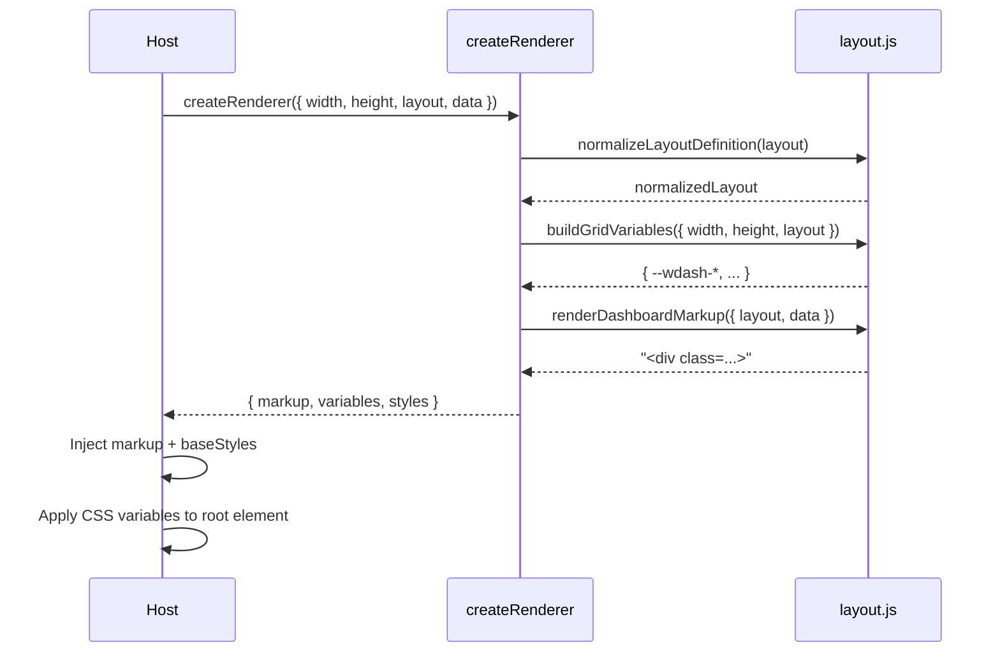

# Weather Dashboard Architecture

This document describes how `dashboard/weather-dashboard.js` boots, interacts with host environments, and renders dashboards using the pure `createRenderer` factory.

## Runtime layers

1. **Hubitat/Preview host** – Loads the bundle (Hubitat via the device driver, preview via `<script>` in `weather-dashboard-app.html`). The host is responsible for measuring container dimensions and providing layout/data payloads.
2. **Prelude guard** – When the script executes it immediately calls `patchDashboardGlitches`, seeding Hubitat's `value` store, guarding `addToDashboardHistory`, and suppressing socket errors so host scripts cannot break rendering before the factory initializes.【F:src/entries/hubitat-dashboard.js†L33-L109】
3. **Renderer bootstrap** – The entry module resolves the preferred renderer factory. If the pure factory is available it exposes `{ createRenderer, baseStyles }` on `window.weatherDashboard` while falling back to the legacy renderer when necessary.【F:src/entries/hubitat-dashboard.js†L111-L167】
4. **Pure renderer** – `createRenderer({ width, height, layout, data })` normalizes the layout JSON, builds CSS custom property variables from the supplied dimensions, and produces DOM-ready markup for each card.【F:src/render/index.js†L60-L78】
5. **Layout utilities** – Helpers in `layout.js` validate track definitions, normalize cards, compute CSS Grid variables, and render card bodies/metrics using the data snapshot.【F:src/render/layout.js†L1-L240】【F:src/render/layout.js†L240-L360】
6. **Host application** – Applies the returned markup into the DOM, injects `baseStyles`, and sets the CSS custom properties on the rendered root. The preview app additionally stores the latest payload, syncs height to the parent frame, and reuses the factory for refreshes.【F:app/weather-dashboard-app.js†L1-L260】【F:app/weather-dashboard-app.js†L260-L520】

## Module interaction diagram

```mermaid
graph TD
  Host[Hubitat device / Preview HTML] --> Prelude[patchDashboardGlitches guard]
  Prelude --> Entry[hubitat-dashboard entry]
  Entry -->|exports| WeatherDashboard[window.weatherDashboard]
  Entry --> Renderer[createRenderer factory]
  Renderer --> LayoutUtils[layout.js utilities]
  LayoutUtils -->|normalize & render| Markup[Dashboard markup]
  Renderer -->|return| Result{{{ markup, variables, styles }}}
  Result --> Host
  Renderer --> Styles[baseStyles CSS]
  Styles --> Host
```

* The host invokes `weatherDashboard.createRenderer` (or the legacy renderer in fallbacks) after measuring the container.
* The factory delegates to `layout.js` to validate and build grid definitions before returning markup, CSS variable mappings, and base styles.

## Data flow



The host maintains ownership of runtime sizing and data delivery. The renderer factory remains pure: it has no side effects beyond returning the markup, styles, and CSS variable map needed to construct the dashboard UI.
